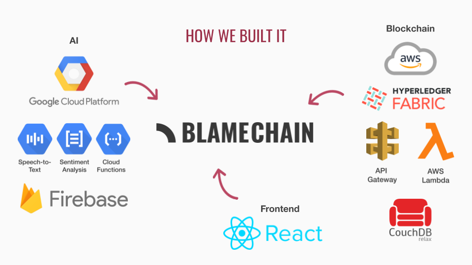

## Inspiration
Sick of getting blamed in arguments when you know they're wrong? Tired of having nothing to say to "you always do this"? Wish you could prove your point with immutable, decentralized, and distributed proof?

Enter Blaimchain.

## What it does
Save all of your arguments onto the blockchain, and blame each other with confidence. Use analytics to determine who's really at fault.

Watch a demo on [Devpost](https://devpost.com/software/blame-game).

## How we built it

The use records and uploads their arguments to GCP cloud functions which then transcribes the audio to text and analyzes the transcript with sentiment analysis using GCP AI services. Each argument transcript is then labeled based on the analysis and both are saved to the blockchain hosted on AWS (Amazon Managed Blockchain). The user then sees analytics computed based on the transcripts and their labels read from the blockchain. The blockchain is accessible via chaincode (Hyperledger smart contracts) and a REST API deployed and hosted with AWS API Gateway and AWS Lambda. Lastly, the frontend ReactJS web application is hosted on GitHub pages.

AI
- GCP 
- Firebase 
- Cloud Functions 
- Speech-to-Text 
- Natural Language Sentiment Analysis 

Blockchain 
- AWS 
- Hyperledger Fabric (blockchain smart contracts) 
- API Gateway 
- Lambda 
- CouchDB 

Front End Web 
- ReactJS

Other
- GitHub Actions
- GitHub Pages

## Challenges we ran into

Blockchain
- Provisioning a blockchain and its nodes was a very long process with many complex configurations
- Updating smart contract code already deployed on the blockchain was much more difficult than updating traditional code
- There are little to no true "blockchain-as-a-database-services" commercially available, so it was a lot of development and technical effort from our team to implement our own database on AWS blockchain technology. 

## Accomplishments that we're proud of

This is our most ambitious and technically sophisticated hack so far! We’re proud that we completed the MVP. This is also our first time working with blockchain and we’re proud that we got it to work!

## What we learned

We learned enough blockchain to make a working prototype and got a lot of experience with GCP AI services and cloud functions.

## What's next for Blamechain

Given more time, we would love to mint every argument as an NFT as a paid premium feature to monetize our project ;)
